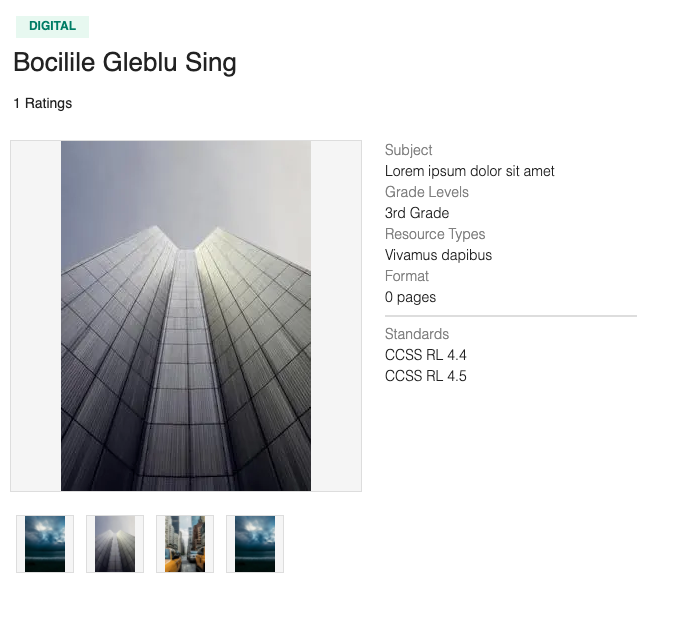

# tptImageModule

> A recreation of the image module from TeachersPayTeachers. Designed to be used in the proxy server under [Related Projects](#Related).

- https://www.teacherspayteachers.com/

Highlighted Technologies: React, Express, Mongo, Jest, Webpack, Grunt, AWS S3 + EC2



## Table of Contents

1. [Getting Started](#Getting)
2. [Testing](#Testing)
3. [Related Projects](#Related)
4. [CRUD](#CRUD)

## Getting Started

From within the root directory:

```
npm install
```

To run on a local machine the mongo database uris in server/index.js and database/index.js will need to be changed from my (now stopped) EC2 instance and put your mongo credentials in a new mongo_creds.js. You will also need to set up your own S3 bucket of images, change the bucket name in databse/seed.js and put the credentials in a new aws_config.js. An additional S3 bucket is needed for grunt to send the bundle.js - change the bucket name in webpack.config.js.

To seed the database

```
npm run seed
```

To start webpack

```
npm run dev
```

Start the server

```
npm run start
```

## Testing

```
npm run test
```

## Related Projects

- https://github.com/rpt24umami/tptQandAService
- https://github.com/rpt24umami/tptReviewsService
- https://github.com/rpt24umami/tptDescriptionAndStandards
- https://github.com/rpt24umami/Proxy-Maggie

## CRUD

#### Create / POST - create a new item

Input

New Product ID is provided. New images document in database will be created associated with new product.

```
Endpoint: `/:id/images`

Request Body:
{ Product ID Number : [Array of up to 5 url strings] }

Request Body example:
{
     "104": [
        "https://tpt-imagesmodule-sdc.s3.amazonaws.com/SDC Images/tptImages (99).jpg",
        "https://tpt-imagesmodule-sdc.s3.amazonaws.com/SDC Images/tptImages (50).jpg"
    ]
 }
```

Output

- If successful, 200 status code and message 'New Product Images Posted (new Document Inserted - see example below)'.

```
New Product Images Posted {
'104': [
'https://tpt-imagesmodule-sdc.s3.amazonaws.com/SDC Images/tptImages (979).jpg',
'https://tpt-imagesmodule-sdc.s3.amazonaws.com/SDC Images/tptImages (500).jpg'
],
_id: 6009cb158282651e4ec2502a,
item: '104',
__v: 0
}
```

- If product ID exists, 404 status code and message 'Product ID (Product ID) exists, can't create duplicate ID'.

#### Read / GET - read an item

Input

```
Endpoint: `/:id/images`
```

Output

```
{
  Product ID Number : [Array of up to 5 url strings],
   item: "Product ID Number",
}

Response example:
  {
    "1":
    [
      "https://tpt-imagesmodule-sdc.s3.amazonaws.com/SDC Images/tptImages (906).jpg",
      "https://tpt-imagesmodule-sdc.s3.amazonaws.com/SDC Images/tptImages (857).jpg",
      "https://tpt-imagesmodule-sdc.s3.amazonaws.com/SDC Images/tptImages (736).jpg",
      "https://tpt-imagesmodule-sdc.s3.amazonaws.com/SDC Images/tptImages (987).jpg"
    ],
    "item": 1,
  "_id":"6009259601b8416eff82e903"}
```

#### Update / PUT - update an item

Input

```
Endpoint: `/:id/images`

Request Body:
{ Product ID Number : [Array of up to 5 url strings] }

Request Body example:
{
    "4": [
        "https://tpt-imagesmodule-sdc.s3.amazonaws.com/SDC Images/tptImages (979).jpg",
        "https://tpt-imagesmodule-sdc.s3.amazonaws.com/SDC Images/tptImages (418).jpg",
        "https://tpt-imagesmodule-sdc.s3.amazonaws.com/SDC Images/tptImages (500).jpg"
    ]
 }
```

Output

- If successful, 200 status code.
- If product ID does not exist, 404 status code and message 'Product ID not found'.

#### Delete / DELETE - delete an item

Input

```
Endpoint: `/:id/images`
```

Output

- If successful, 200 status code.
- If product ID does not exist, 404 status code and message 'Product ID not found'.
